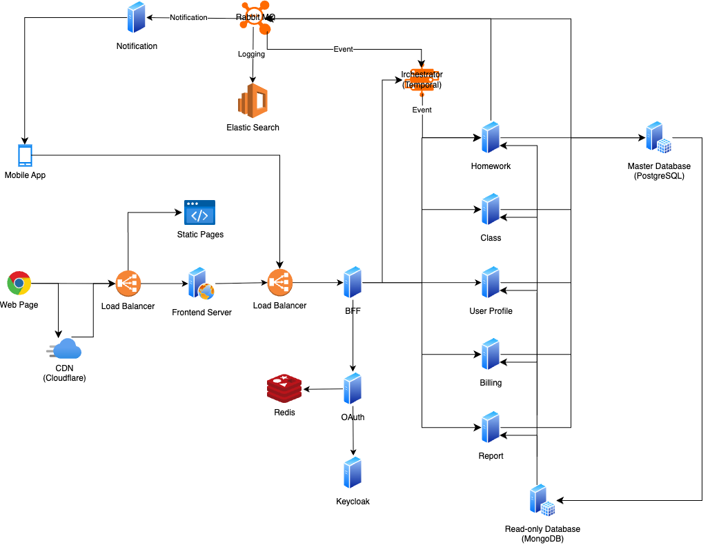

# Architecture of TSIS

## Tech Stack Overview

| Layer                   | Tech                                                 | Purpose                                                                                                          |
| ----------------------- | ---------------------------------------------------- | ---------------------------------------------------------------------------------------------------------------- |
| Frontend                | **Angular**                                          | Role-based dashboards for Admin, Tutor, and Student                                                              |
| Mobile                  | **Flutter**                                          | Native-style student app to watch classes, submit homework, and check attendance                                 |
| Backend (BFF)           | **Node.js (Express)**                                | Backend-for-Frontend layer exposing REST APIs, handling session/auth, role-based access, and request aggregation |
| Microservices           | **Node.js (Express)**                                | Each service (e.g., auth, class, homework) is independently deployed and owns its business logic                 |
| API Design              | **RESTful API + Swagger (OpenAPI)**                  | Services expose documented REST APIs via Swagger UI                                                              |
| Containerization        | **Docker + Kubernetes (K8s)**                        | Each service runs in an isolated container; managed via K8s for orchestration and scaling                        |
| Cloud Infra             | **AWS (EC2, Lambda, RDS, S3) + Cloudflare**          | AWS for compute/storage/serverless; Cloudflare for CDN, HTTPS, and DDoS protection                               |
| Networking              | **AWS ALB (Application Load Balancer)**              | Distributes incoming traffic across BFF/API services for high availability and scaling                           |
| VPC Networking          | **NAT Gateway + Private/Public Subnet Split**        | Allows internal services to access the internet securely while keeping critical infra private                    |
| Database                | **PostgreSQL (write) + MongoDB (read)**              | CQRS + Outbox Pattern: PostgreSQL for transactional writes, MongoDB for fast reads and dashboards                |
| Data Sync               | **Redis Pub/Sub**                                    | Event-driven sync from write DB to read DB                                                                       |
| Logging & Observability | **RabbitMQ + Logstash (ELK: Elasticsearch, Kibana)** | Logs sent via queue, centralized search and visualization for audit and debugging                                |
| Auth                    | **Keycloak (JWT-based)**                             | Centralized identity and access management, using stateless JWT tokens                                           |
| Testing                 | **Postman, Cypress**                                 | Unit, integration, and end-to-end testing to ensure reliability and regressions                                  |
| CI/CD                   | **GitHub Actions + AWS Deployment**                  | Auto linting, testing, and deployment on push or PR merge                                                        |
| GitOps                  | **GitHub (PRs, branch policies, issue workflows)**   | Source of truth for code and infrastructure; changes tracked via reviews and branches                            |

## Architectural Decision Records (ADR)

## System Architecture Diagram

