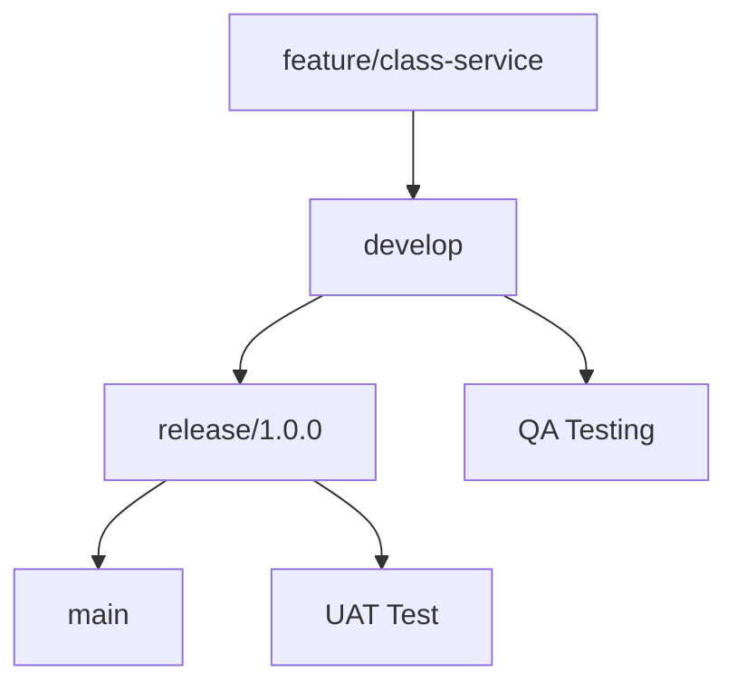

# Project Plan

## Project Title

Tutoring Student Management System (TSIS)

## Duration

June 2025 – June 2026 (12 months)

## Project Type

Solo side project (portfolio-grade, self-managed, open source)

## Methodology

TSIS follows an iterative, milestone-based development model inspired by Agile practices. Features are broken down into user stories and grouped into monthly targets using the GitHub Project Board:

🔗 [GitHub Project Tracker](https://github.com/users/AnsonCheng03/projects/3/)

## Work Breakdown Structure (WBS)

| Phase                    | Key Activities                                                                |
| ------------------------ | ----------------------------------------------------------------------------- |
| Planning & Research      | Requirements gathering (BRD), domain modeling, technical architecture design  |
| Infrastructure Setup     | CI/CD pipeline, database/schema setup, Keycloak integration, Pub/Sub config   |
| Microservice Development | Implementation of services (class, user, attendance, billing, homework, etc.) |
| Frontend Development     | Angular admin dashboard + Flutter student app                                 |
| AI Integration           | Essay scoring, feedback generation, credit deduction logic                    |
| Testing                  | Unit, integration, BDD, Cypress/End-to-End testing                            |
| UAT & Bug Fixing         | Walkthrough testing, feedback handling, UI polish                             |
| Deployment               | Docker, Kubernetes manifests, AWS deployment script                           |
| Documentation            | BRD, SOW, Architecture, User Guide, API Docs (Swagger), UAT checklist         |

## Milestone Calendar

| Month | Milestone Summary                                       |
| ----- | ------------------------------------------------------- |
| M1    | Project setup, architecture finalized, BRD written      |
| M2    | Core infra: Auth, logging, CI/CD, DB schema             |
| M3-M4 | User/Class/Attendance/Notification service complete     |
| M5-M6 | Homework, Billing, AI scoring, Mongo read model ready   |
| M7    | Report service, PDF/CSV export, data dashboards         |
| M8-M9 | Web (Admin/Tutor) and Mobile (Student) UI development   |
| M10   | QA: Unit, integration, and E2E testing                  |
| M11   | UAT scenarios tested, final bug fixing and polish       |
| M12   | Final documentation, demo walkthrough, deployment setup |

## Tools & Tracking

| Purpose          | Tool                     |
| ---------------- | ------------------------ |
| Source Control   | Git + GitHub             |
| Project Tracking | GitHub Projects (Kanban) |
| Documentation    | Markdown (`/docs`)       |
| API Docs         | Swagger/OpenAPI          |
| Test & QA        | Postman, Cypress         |
| DevOps & CI/CD   | GitHub Actions + Docker  |

## Risk & Mitigation

| Risk                                  | Mitigation Strategy                                      |
| ------------------------------------- | -------------------------------------------------------- |
| Time conflicts with full-time work    | Flexible milestones, progress tracked weekly             |
| Feature creep (too many ideas)        | All scope changes go through GitHub Issue + tag approval |
| Integration failures between services | Adopt contract-first API design (Swagger + shared DTO)   |
| Motivation drop-off                   | Milestone reward system and public tracking              |

## Change Management

- All changes (new features, tech stack, architecture changes) must be recorded in a GitHub Issue
- Major shifts must be approved before added to milestone scope
- Features not completed within the target window will be moved to next month's backlog

## Branch Management

The project uses a simplified but structured Git branching strategy to separate development, quality assurance, and deployment stages. This helps simulate a real-world CI/CD flow even for a solo project, and prepares the system for future collaboration or scaling.

### Primary Branches

| Branch Name     | Purpose                                                              |
| --------------- | -------------------------------------------------------------------- |
| `main`          | Production-ready code. Only merged after UAT and full QA validation. |
| `release/x.y.z` | Pre-release version used for User Acceptance Testing (UAT).          |
| `dev`           | Central branch for integrating features and running QA.              |

> Note: All feature branches are merged into `dev`, and only tested, approved versions are promoted to `release/*`, then to `main`.

> Branch protection rules may be simulated through GitHub settings even for a solo project, to practice PR discipline.

### Supporting Branches

| Branch Name Pattern | Purpose                                | Example                   |
| ------------------- | -------------------------------------- | ------------------------- |
| `feature/<name>`    | New features under development         | `feature/ai-feedback`     |
| `fix/<issue>`       | Bug fixes                              | `fix/login-timeout`       |
| `hotfix/<name>`     | Urgent patch to `main`                 | `hotfix/billing-rounding` |
| `doc/<section>`     | Documentation updates                  | `doc/bdd-stories`         |
| `test/<component>`  | Experimental or QA automation branches | `test/e2e-homework-flow`  |

### Branching Flow

## Communication Plan

| Audience       | Channel                       | Frequency      |
| -------------- | ----------------------------- | -------------- |
| Public Logs    | GitHub Project Board + README | Monthly update |
| Personal Notes | Obsidian / Notion (private)   | Daily log      |

## Review & Closure

The project is considered complete when:

- ✅ All BRD stories are implemented
- ✅ CI/CD passes full test coverage
- ✅ Live deployment or local Docker version is working
- ✅ System demo and documentation are published publicly
